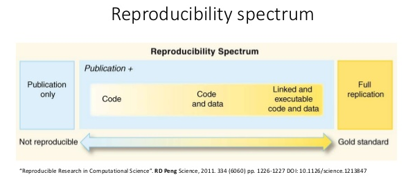

```{r, echo = FALSE}
knitr::opts_chunk$set(collapse = TRUE, comment = "#>")
```

<br>

## Data Science


- 데이터로 부터 새로운 통찰력과 지식을 얻기 위한 학문이자 실무분야

- 컴퓨터 관련 전공자 외에도 모든 분야의 연구자들에게 필요한 기반지식

- 4차 산업혁명의 근간에 데이터가 존재

<br>

```{r echo = FALSE, out.width = "60%", fig.align='center'}
knitr::include_graphics("image/data-ability.png")
```


<br>

## DS Workflow

<br>

[Hadley Wickham](http://hadley.nz/)은 **data science workflow**를 다음과 같이 정의:

<br>

```{r echo = FALSE, fig.cap = "Source: R for Data Science by Garrett Grolemund and Hadley Wickham.", out.width = "70%", fig.align='center'}
knitr::include_graphics("image/data-science.png")
```


<br>

#### **Import**

- CSV, XML, HTML, Json 등 다양한 형태의 데이터를 Web crawling 등 다양한 방식으로 수집하거나 R로 import 하는 방법 습득

<br>


#### **Tidy**

- Tidy data와 이를 위한 Tidyverse 방법론 습득

- SDMX, 표준의 중요성  

<br>


#### **Transform**

- DB를 활용한 대용량 데이터 핸들링 방법

- high performance computation 

<br>

#### **Visualize**

- ggplot2

<br>

#### **Model**

- Leanear Regression

- Repeated Sales Methods

- tibble과 List columns을 활용한 모델링 및 분석결과 단순화 방법론

<br>

#### **Communicate**

- R markdown

- shiny

<br>

<br>

## Importance of Programming

- Automation

- High performance

- Advanced analysis

- Reproducibility


<br>


```{r echo = FALSE, out.width = "60%", fig.align='center'}
knitr::include_graphics("image/automation.png")
```

<br>

## Reproducible Research

**Reproducibility** is _“the idea that data analyses, and more generally, scientific claims, are published with their data and software code so that others may verify the findings and build upon them.”_


```{r echo = FALSE, out.width = "80%", fig.align='center'}

```

