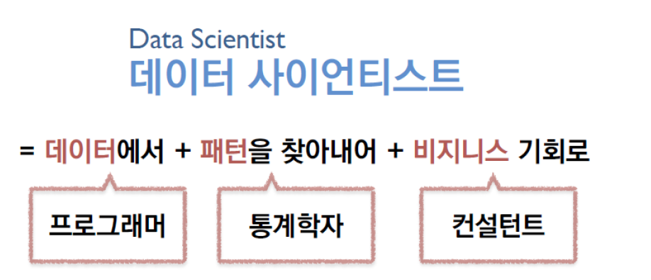
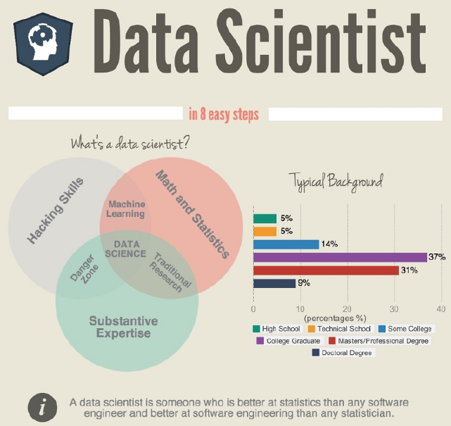
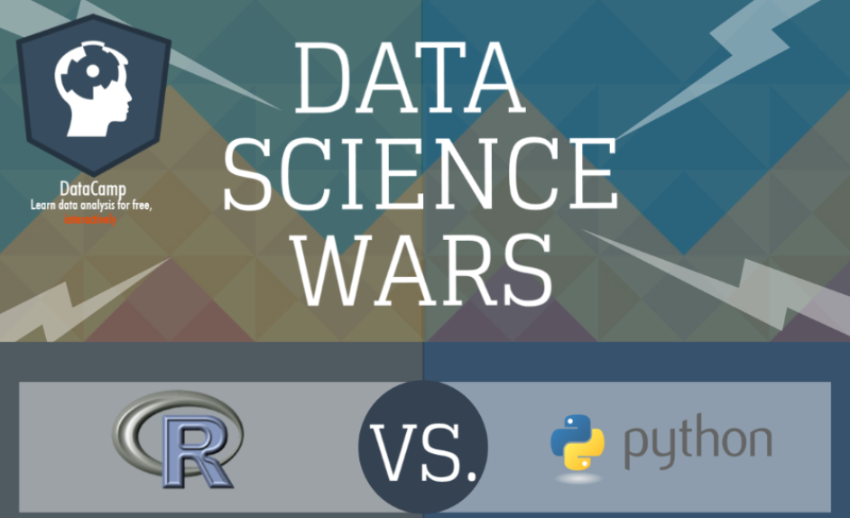

exclude: true

```{r, message=FALSE, warning=FALSE, include=FALSE}
options(
  htmltools.dir.version = FALSE, # for blogdown
  width=80
)

# library(emo)
htmltools::tagList(rmarkdown::html_dependency_font_awesome())
```
---

## Data Scientist?


```{r echo = FALSE, out.width = "100%", fig.align='center'}

```


<br>

> “Data Scientiest is the most sexiest job of the 21st Century”
>
> `r tufte::quote_footer('--- by Harvard Business Review')`


---

## Data Scientist in 8 Easy Steps


```{r echo = FALSE, out.width = "70%", fig.align='center'}

```

https://infographicjournal.com/how-to-become-a-data-scientist-in-8-easy-steps/

<br>

---
background-image: url("image/superman.png")

---
background-image: url("image/team-sports.png")

---
background-image: url("image/ds-teams.png")

## Data Scientist Team
---
background-image: url("image/ds-important.png")

---

## R vs Python


- [R](https://en.wikipedia.org/wiki/R_(programming_language)

- [Python](https://en.wikipedia.org/wiki/Python_(programming_language)

```{r echo = FALSE, out.width = "70%", fig.align='center'}

```

https://www.datacamp.com/community/tutorials/r-or-python-for-data-analysis
---
class: .large

## Why R?

.large[
- [RStudio](https://www.rstudio.com/) and [Hadley Wickham](http://hadley.nz/)

  *  [Tidyverse](https://www.tidyverse.org/)
  *  Tibble & List column
  *  [R Markdown](https://rmarkdown.rstudio.com/)
  *  [Shiny](https://shiny.rstudio.com/)
  *  ggplot2 - [Top 50 ggplot2 Visualizations](http://r-statistics.co/Top50-Ggplot2-Visualizations-MasterList-R-Code.html)
  

- Reproduciable Research

- Mostly Used by Statisticians

]
