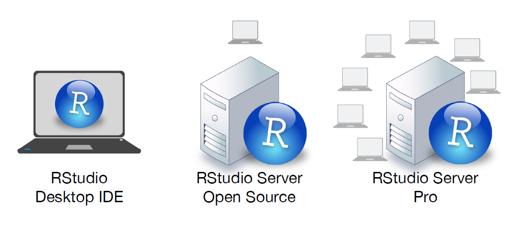

```{r, echo = FALSE}
knitr::opts_chunk$set(collapse = TRUE, comment = "#>")
```


<br>

## Programs to download  

- [R](https://cran.r-project.org/) 

- [RStudio](https://www.rstudio.com/products/rstudio/download/) 

- [RStudio Preview](https://www.rstudio.com/products/rstudio/download/preview/) 

- [R Tools](https://cran.r-project.org/bin/windows/Rtools/) 

- [D2Coding](https://github.com/naver/d2codingfont/releases) 

<br>

## Rstudio IDE

```{r echo = FALSE, out.width = "75%"}
knitr::include_graphics("diagrams/rstudio-editor.png")
```

<br>

## RStudio IDE

```{r echo = FALSE, out.width = "75%"}

```

<br>

## RStudio IDE 주요설정

- [Tools] -> [Global Options...]

- General : 

  ** check the R version
  ** set default working directory
  ** uncheck "Restore .RData into workspace at startup"
  ** set "Save workspace to .RData on exit" to "Never" 

- Code

  ** Saving Tab : set "default text encoding to "UTF-8"

- Appearance

  ** set "Editor font" to "D2Coding"
  ** set "Editor font size" to  "12"
  
- Pane Layout 

  ** set as you please


<br>

## Short Keys to remember

|short key            |의미  
|:--------------------|:-------------
|Ctrl + Enter         |한줄 실행
|Ctrl + Shift + S     |전체실행
|Ctrl + L             |clear console
|Alt + -              |insert "<-"
|Ctrl + Shift + M     |insert "%>%"
|Ctrl + Shift + C     |(un)comment lines
|Ctrl + Shift + 1     |zoom source

<br>

## Windows의 "한글" 인코딩 문제

- 윈도우는 `CP949`가 기본 세팅 (맥이나 리눅스는 `UTF-8`)

```{r}
Sys.getlocale()
```


- 위도우에서 엑셀데이터를 .csv 파일로 저장할 때  항상 `UTF-8`로 저장

```
write.csv("filename.csv", fileEncoding = "UTF-8")
```

- 윈도우에서 저장한 .csv 파일 읽을 때 `EUC-KR`로

```
read.csv("fimename.csv", fileEncoding = "EUC-KR")
```

- 스트링 인코딩 변환

```
str_encode(k, from "EUC-KR", "UTF-8")
```

<br>

## 프로젝트 생성 관리

- [File] ._ [New Project ...]

- 오른쪽 상단 [project] 버튼


<br>


## Reference

- [RStudio IDE Cheat Sheet](https://www.rstudio.com/resources/cheatsheets/#ide)


