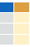
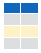
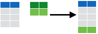

```{r code01, echo = FALSE}
knitr::opts_chunk$set(collapse = TRUE, comment = "#>")
```

<br>


## Basic Command


<!-- 도움말 -->

<div class="comment">

<div class="boxx" style="font-size: 25px;"><strong>Getting Help</strong></div>

<div class="boxx2">도움말 보기</div>

<div class="grid-container">
<div class="grid-item"><span class="tcode">?mean</span></div>
<div class="grid-item">"특정함수"에 대한 도움말 보기</div>
<div class="grid-item"><span class="tcode">help.search('weighted mean')</span></div>
<div class="grid-item">"특정 용어"에 대한 도움말 검색</div>
<div class="grid-item"><span class="tcode">help(package = 'dplyr')</span></div>
<div class="grid-item">"특정 패키지"에 대한 도움말 보기</div>
</div>

<div class="boxx2">객체에 대한 정보 보기</div>

<div class="grid-container">
<div class="grid-item"><span class="tcode">str(iris)</span></div>
<div class="grid-item">객체 구조에 대한 요약정보 보기</div>
<div class="grid-item"><span class="tcode">class(iris)</span></div>
<div class="grid-item">객체의 class 조회</div>
</div>

</div>

<!-- Using Package -->

<div class="comment">
<div class="boxx" style="font-size: 25px;"><strong>패키지 Using Packages</strong></div>

<div class="grid-container">
<div class="grid-item"><span class="tcode">install.packages('dplyr')</span></div>
<div class="grid-item">Download and install a package from CRAN.</div>
<div class="grid-item"><span class="tcode">library('dplyr')</span></div>
<div class="grid-item">Load the package, making all its functions available to use.</div>
<div class="grid-item"><span class="tcode">dplyr::select</span></div>
<div class="grid-item">Use a particular function from a package</div>
<div class="grid-item"><span class="tcode">data(iris)</span></div>
<div class="grid-item">Load a built-in dataset into the environment.</div>
</div>

</div>


<!-- Working Directory -->

<div class="comment">
<div class="boxx" style="font-size: 25px;"><strong>워킹디렉토리 Working Directory</strong></div>

<div class="grid-container">
<div class="grid-item"><span class="tcode">getwd()</span></div>
<div class="grid-item">Find the current working directory.</div>
<div class="grid-item"><span class="tcode">setwd('D://file/path')</span></div>
<div class="grid-item">Change the current working directory.</div>
</div>


<div class="grid-container1">
<div class="grid-item"><strong>Use Projects in RStudio to set the working directory to the folder you are working in.</strong></div>
</div>

</div>


<!-- Variable Assignment -->

<div class="comment_line">
<div class="boxx" style="font-size: 25px;"><strong>Variable Assignment</strong></div>

<div class="grid-container1">
```{r code02}
a <- 'apple'
a
```
</div>

</div>


<!-- The Environment -->

<div class="comment_line">
<div class="boxx" style="font-size: 25px;"><strong>The Environment</strong></div>

<div class="grid-container1">
```{r}
rm(list = ls())
a <- "apple"
b <- c(1,2,3)
c <- 1

ls()
rm(a)
ls()
rm(list = ls())
```
<p>You can use the environment panel in RStudio to browse variable in your environment.</p>

</div>


</div>


## Read & Write data

<!-- Reading and Writing Data -->

<div class="comment_line">
<div class="boxx" style="font-size: 25px;"><strong>파일 입출력  Reading and Writing Data</strong></div>

<div class="grid-container1">
```{R eval=FALSE}
## create txt file
# fileConn<-file("file.txt")
# writeLines(c("Hello","World"), fileConn)
# close(fileConn)

df <- c("Hello","World")
write.table(df, 'file2.txt')

df2 <- read.table('file2.txt')
print(df2)
```

```{R eval=FALSE}
df <- c("apple","graph")
write.csv(df, 'file3.csv')

df3 <- read.csv('file3.csv')
print(df3)
```

```{R eval=FALSE}
df <- c("apple3","graph3")
save(df, file = 'file4.Rdata')

load('file4.Rdata')
print(df)
```

</div>

</div>


## Daty Types

<!-- Types -->

<div class="comment_line">

<div class="boxx" style="font-size: 25px;"><strong>객체 타입  Types</strong></div>

<div class="grid-container1">
<p>Coverting between common data types in R. Can always go from a higher value i the table to a lower value</p>
</div>

```{R}
a <- c(TRUE, FALSE, TRUE)
print(a)
typeof(a)

a <- as.numeric(a)
print(a)
typeof(a)

a <- as.logical(a)
print(a)
typeof(a)

a <- as.character(a)
print(a)
typeof(a)

a <- as.factor(a)
print(a)
typeof(a)

```


</div>


<!-- Vector -->

<div class="comment_line">
<div class="boxx" style="font-size: 25px;"><strong>Vectors</strong></div>

<div class="boxx2">Creating Vectors</div>
<div class="grid-container1">

```{r size="huge"}
c(2, 4, 6)              # Join elements into a vector 
2:6                     # An interger sequence
seq(2, 3, by=0.5)       # A complex sequence
rep(1:2, times=3)       # Repeat a vector
rep(1:2, each=3)        # Repeat elements of a vector
```
</div>

<div class="boxx2">Vector Functions</div>
<div class="grid-container1">

```{r}
x <- c(3,2,6,1,6,2)
sort(x)
rev(x)
table(x)
unique(x)
```
</div>


<div class="boxx2">Selecting Vector Elements</div>

<div class="grid-container1">
<div class="grid-item"><strong>By Position</strong></div>

```{r}
x <- c(3,2,6,1,6,2)
x[4]
x[-4]
x[2:4]
x[-(2:4)]
x[c(1,5)]
```

<div class="grid-item"><strong>By Value</strong></div>
```{r}
x <- c(3,2,6,1,6,2)
x[x==6]
x[x<3]
x[x %in% c(2,6)]
```

<div class="grid-item"><strong>Named Vectors</strong></div>
```{r eval=FALSE}
x['apple']
```

</div>

</div>


<!-- 매트릭스 -->

<div class="comment_line">
<div class="boxx" style="font-size: 25px;"><strong>매트릭스 Matrices</strong></div>

<div class="boxx2">matrix basic</div>

<div class="grid-container">
<div class="grid-item"><span class="tcode">m <- matrix(x, nrow = 3, ncol = 3)</span></div>

<div class="grid-item">matrix 생성</div>
</div>

<div class="grid-container3">
<div class="grid-item"></div>
<div class="grid-item"><span class="tcode">m[2, ]</span></div>
<div class="grid-item">Select a row</div>
<div class="grid-item"></div>
<div class="grid-item"><span class="tcode">m[ , 1]</span></div>
<div class="grid-item">Select a column</div>
<div class="grid-item"></div>
<div class="grid-item"><span class="tcode">m[2, 3]</span></div>
<div class="grid-item">Select an element</div>
</div>

<div class="boxx2">matrix 연산</div>

<div class="grid-container">
<div class="grid-item"><span class="tcode">t(m)</span></div>
<div class="grid-item">Transpose</div>
<div class="grid-item"><span class="tcode">m %*% n</span></div>
<div class="grid-item">Matrix Muliplication</div>
<div class="grid-item"><span class="tcode">solve(m, n)</span></div>
<div class="grid-item">Find x in: m * x = n</div>

</div>


</div>


<!-- Lists -->

<div class="comment_line">
<div class="boxx" style="font-size: 25px;"><strong>Lists</strong></div>

<div class="grid-container1">

<p>A list is a collection of elements which can be of different types.</p>


```{r bbb}
# List 생성
l <- list(x = 1:5, y = c('a','b'))
l

# List subset
l[[2]]
l[1]
l$x
l['y']
```

</div>


</div>


<!-- Data Frames -->

<div class="comment_line">
<div class="boxx" style="font-size: 25px;"><strong>Data Frames</strong></div>

<div class="grid-container1">

<p>A special case of list where all elements are the same length.</p>


```{r}
# Data Frame 생성
df <- data.frame(x=1:3, y = c('a','b','c'))
df

# Understanding a data frame
# View(df)
head(df, 2)

nrow(df)
ncol(df)
dim(df)
```

</div>


<div class="boxx2">Matrix subsetting</div>

<div class="grid-container4">
<div class="grid-item"></div>
<div class="grid-item"><span class="tcode">df[ , 2]</span></div>
<div class="grid-item"></div>
<div class="grid-item"><span class="tcode">df[2, ]</span></div>
<div class="grid-item"></div>
<div class="grid-item"><span class="tcode">df[2, 2]</span></div>
<div class="grid-item"></div>
<div class="grid-item"><span class="tcode">df$x</span></div>
<div class="grid-item"></div>
<div class="grid-item"><span class="tcode">df[[2]]</span></div>

</div>

<div class="boxx2">Binding data frames</div>

<div class="grid-container33">
<div class="grid-item"></div>
<div class="grid-item"><span class="tcode">cbind</span></div>
<div class="grid-item">Bind columns</div>
</div>

<div class="grid-container33">
<div class="grid-item"></div>


<div class="grid-item"><span class="tcode">rbind</span></div>
<div class="grid-item">Bind rows</div>
</div>

```{r}
A <- data.frame(x=1:3, y=c('a','b','c'))
B <- data.frame(y=11:13)
C <- data.frame(x=4:5, y=c('d','e'))

cbind(A, B)

rbind(A, C)
```


<!-- Strings -->

<div class="comment_line">
<div class="boxx" style="font-size: 25px;"><strong>Strings</strong></div>

<div class="grid-container1">

```{r}
# paste
x = "Hello"
y = "World!"
z = "My name is DK"

paste(x, y)
paste(x, y, sep='')
paste(x, y, sep='-')

paste(z, collapse=' ')

# Find regular expression matches in x.
pattern = "DK"
replace = "Dookyung"

grep(pattern, z)

# replace matches in x with a string.
gsub(pattern, replace, z)

toupper(replace)
tolower(replace)
nchar(replace)

```

</div>

</div>


<!-- Factors -->

<div class="boxx_line" style="font-size: 25px;"><strong>Factors</strong></div>

```{}
# Factors
factor(x)

cut(x, breaks = 4)
```
<hr>


## Programming


<!-- Programming -->

<div class="comment_line">
<div class="boxx" style="font-size: 25px;"><strong>프로그래밍 Programming</strong></div>

<div class="boxx2">For Loop</div>

<div class="grid-container1">

```
for (variable in sequance){
    Do something
}
```

```{R aaa}
for (i in 1:4){
    j <- i + 10
    print(j)
}

```

</div>


<div class="boxx2">While Loop</div>

<div class="grid-container1">

```
while (condition){
    Do something
}
```

```{R}
while (i < 5){
    print(i)
    i <- i + 1
}

```

</div>

<div class="boxx2">If Statements</div>

<div class="grid-container1">

```
if (condition){
    Do something
} else {
    Do something different
}
```

```{R}
i = 5

if (i > 3){
    print('Yes')
} else {
    print('No')
}


```

</div>


<div class="boxx2">Functions</div>

<div class="grid-container1">

```
function_name <- function(var){
    Do something
    return(new_variable)
}
```

```{R}
square <- function(x){
    squared <- x * x
    return(squared)
}

square(5)
```

</div>


<div class="boxx2">Condtions</div>

<div class="grid-container4">

<div class="grid-item">a == b</div>
<div class="grid-item">a != b</div>
<div class="grid-item">a > b</div>
<div class="grid-item">a < b</div>
<div class="grid-item">a >= b</div>
<div class="grid-item">a <= b</div>
<div class="grid-item">is.na(a)</div>
<div class="grid-item">is.null(a)</div>

</div>

<div class="grid-container1">
```{R}
a <- c(1, 4, NA, 6)
is.na(a)
is.null(a)
```
</div>


</div>


<!-- Maths Functions -->

<div class="comment">
<div class="boxx" style="font-size: 25px;"><strong>Math Functions</strong></div>

<div class="grid-container4">
<div class="grid-item"><span class="tcode">log(x)</span></div>
<div class="grid-item"><span class="tcode">sum(x)</span></div>
<div class="grid-item"><span class="tcode">exp(x)</span></div>
<div class="grid-item"><span class="tcode">mean(x)</span></div>
<div class="grid-item"><span class="tcode">median(x)</span></div>
<div class="grid-item"><span class="tcode">max(x)</span></div>
<div class="grid-item"><span class="tcode">min(x)</span></div>
<div class="grid-item"><span class="tcode">round(x, n)</span></div>
<div class="grid-item"><span class="tcode">rank(x)</span></div>
<div class="grid-item"><span class="tcode">signif(x, n)</span></div>
<div class="grid-item"><span class="tcode">var(x)</span></div>
<div class="grid-item"><span class="tcode">cor(x, y)</span></div>
<div class="grid-item"><span class="tcode">sd(x)</span></div>

</div>

</div>

## Statistics and Distributions

<!-- Statistics -->

<div class="boxx_line" style="font-size: 25px;"><strong>Statistics</strong></div>

<div class="grid-container2">
<div class="grid-item"><span class="tcode">lm(y ~ x, data=df)</span></div>
<div class="grid-item">Linear model.</div>
<div class="grid-item"><span class="tcode">glm(y ~ x, data=df)</span></div>
<div class="grid-item">Generalised linear model.</div>
<div class="grid-item"><span class="tcode">summary(x)</span></div>
<div class="grid-item">Get more detailed information out a model.</div>
<div class="grid-item"><span class="tcode">t.test(x, y)</span></div>
<div class="grid-item">Perform a t-test for different between means</div>
<div class="grid-item"><span class="tcode">pairwise.t.test()</span></div>
<div class="grid-item">Perform a t-test for paired data.</div>
<div class="grid-item"><span class="tcode">prop.test</span></div>
<div class="grid-item">Test for a difference between proportions.</div>
<div class="grid-item"><span class="tcode">aov</span></div>
<div class="grid-item">Analysis of variance.</div>

</div>

<hr>


<!-- Distributions -->

<div class="boxx_line" style="font-size: 25px;"><strong>Distributions</strong></div>
<br><br>


```{R echo=FALSE, message=FALSE, results='asis'}
library(tidyverse)
df <- tribble(
    ~kind, ~Random_Var, ~Density_Func, ~Cumulative_Dist, ~Quantile,
    "Normal", "rnorm", "dnorm", "pnorm", "qnorm",
    "Poisson", "rpois", "dpois", "ppois", "qpois",
    "Binomial", "rbinom", "dbinom", "pbinom", "qbinom",
    "Uniform", "runif", "dunif", "punif", "qunif"
    )

knitr::kable(df, caption="Distribution table")

```


<hr>


<!-- Plotting -->

<div class="boxx_line" style="font-size: 25px;"><strong>Plotting</strong></div>
<br>

```{R}
x <- rnorm(30)
y <- rnorm(30) + 1:30

par(mfrow=c(1,2))
plot(x)
plot(y, x)
```

```{r}
duration = faithful$eruptions 

hist(duration, right=FALSE)

```


<hr>


